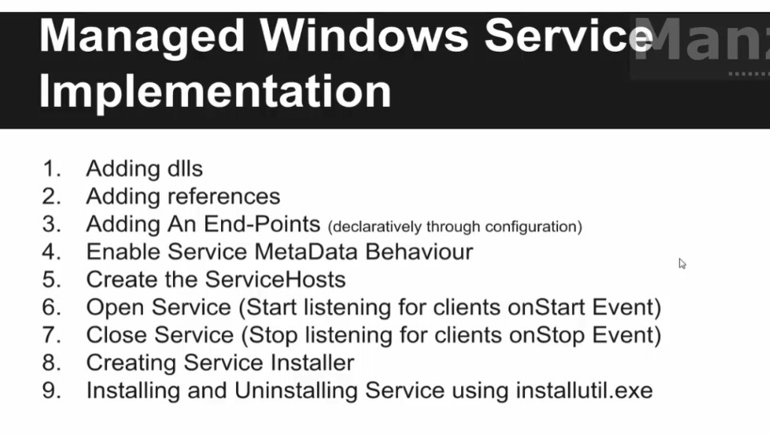

WCF
===
# What is?
 - Windows Communication Foundation
 - Unified programming model for writing distributed application on the Microsoft platform.
 - SDK for developing and deploying services on Windows


----------------------------
1. Creating a service

2. Hosting a service

3. Consuming a service

- wcf는 위으 세가지로 구성된다고 보면 된다.

서비스를 생성하고

빌드 후 실행하면 .net 프레임워크?가 자동으로 웹서비스를 호스팅해준다.

그러면 웹 주소를 통하여 사용하기만 하면 끝이다.


- 서비스 생성은 기본 인터페이스와 인터페이스를 구현하는 클래스로 구성된다.

Interface는 world에 노출되고, class에 구현한 것을 실행한다.

--------------------------
# SOA
* Service Oriented Architecture
 - reusable component on the network
 - collection of services on a network that communicate with one another
 - Services are well-defined, platform-independent interfaces and reusable


# Web Service
 - A web service is a unit of managed code that can be remotely invoked using HTTP

# End Points(ABCs)
 - End Points are alos called as ABCs of services;
 - A stands for Address(127.0.0.1)
 - B stands for Binding(http, net.tcp, net.pipe, net.msmq)
 - C stands for Contract(Interfaces and Methods)
 - Server side의 abc와 Client side의 abc가 일치해야 한다

```
    // Server side
    <service name="MultipleWcfServiceLibrary.MultipleService" behaviorConfiguration="MyServiceTypeBehaviors">
        <endpoint 
	    address="http://localhost:11987/MyMultipleServiceHost.svc"
	    binding="basicHttpBinding" bindingConfiguration="" 
	    contract="MultipleWcfServiceLibrary.IMultipleService" />
    </service>

    // Client side
    <endpoint 
        address="http://localhost:11987/MyMultipleServiceHost.svc"
        binding="basicHttpBinding" bindingConfiguration="BasicHttpBinding_IMultipleService"
        contract="MultipleServiceReference.IMultipleService" name="BasicHttpBinding_IMultipleService" />
```
-------------
# Hosting options
 - WCF를 hosting 할 수 있는 방법은 4가지이다.

## 1. Self-Hosting in a Managed Application
  - 아래의 3가지 방법 중 하나를 사용하여 c#코드를 작성하는 것을 의미
    - Console Application
    - Windows Form Application
    - WPF Application
  - To manage the host life cycle i.e., creating and opening an instance of the **ServiceHost** class to make the service available and closing the instance after use.
    - 호스팅을 할 때 생성 오픈 종료 등의 동작을 수동으로 해야한다.(IIS같은 경우는 자동으로 해준다)
  - 개발 단계에서 사용. 데이터를 트레이싱 하기 쉽고, 어플리케이션 내부에서 어떤 일이 일어나는지 알 수 있다. 따라서 Debuging이 쉽다.(디버깅 용도?)
  - 개발시 콘솔에서 하고 Windows Services로 넘어감
  - Protocol : http, net.tcp, net.pipe, net.msmq
  - 사용법
    1. Adding dlls
    2. Adding references
    3. Create the ServiceHost
    4. Adding an End-Point(코드에서 적거나 설정(Web.config)에서)
    5. Enalbe service metadata behavior
    6. Open service(Start listening for clients)
    7. Close service(Stop listening for clients)
 - MEX Endpoint(Metadata Exchange)
   인간이 읽을 수 있는 방식이 아닌 방식으로 사용?
 - svcutil의 기능
   - Proxy Class를 만든다
   - Microsoft Visual Studio Command Prompt를 관리자 권한으로 실행하고 svcutil net.tcp://localhost:50011/mex /out:"D:MyProxy.cs" /config:"D:MyProxy.config"를 하면 프록시 클래스를 볼 수 있다

## 2. Managed Windows Service
 - Microsoft Windows services(=NT services)
   - Windows sessions 위에서 동작
   - enables to create long-running executable applications
   - can be automatically started when the computer boots, can be paused and restarted, and do not show any user interface
     - SQL services처럼 한번 실행하면 재부팅을 해도 OS의하여 자동 재실행 및 운영됨
   - IIS이외에 WCF service를 장시간 운영할 때 사용
   - 장점
     - 한번 OS에 의해 운영되고 재시작됨
     - 오류 발생시 자동으로 Windows Service Control Manager에 으해 재시작됨
     - Secure enviroment
   - 단점
     - 설치해야 함
  - Protocol : http, net.tcp, net.pipe, net.msmq

 - how to do
 

## 3. Internet Information Services(IIS)

## 4. Windows Process Activation Service(WAS)
 - new process activation service that is generalization of IIS features that work with non-HTTP transport protocols
 - Such as Tcp, named pipes, and Message Queuing
 - 요약하자면 IIS(IIS 7 이상)에서 동작하는 non-HTTP binding을 위한 WCF services 이다.


# IIS 설치
 1. 윈도우즈 기능 켜고 끄기
 2. 인터넷 정보 서비스
 3. 응용 프로그램 개발 기능
 4. ASP.NET 4.8
 5. 윈도우 검색창에서 inetmgr 치면 ISS 관리 패널 나옴


# Binding
 - 접속에 대한 세부 설정
 - App.config -> 우클릭 -> Edit WCF Configuration을 통하여 수정 간으
 - 코드에서도 수정 가능

# Contract
 - 클라이언트가 service에서 무엇을 할 수 있는 가를 나타냄, capability or feature set
 - 메시지 포맷 설정 가능 : json , xml등
 - Type of contract
   - Service contract : 클라이언트가 service에서 무엇을 할 수 있는 가
   - Data contract : 어떤 데이터를 주고 받을지를 결정
   - Fault contract : 에러, 얘외 핸들링
   - Message contract : 메시지 포맷을 정하여 이기종(interoperability)간의 통신가능하게 함, 거의 사용 X
 - 서비스 상속 가능

# Service Client Proxy?
 - 서비스 라이브러리에서 ServiceContract와 OperationContract의 Name을 바꾸는 것
 - 서비스에서는 오버로딩을 지원하지 않기 때문에 이를 통하여 메서드 이름을 바꾸어 서비스 한다.
 - [ServiceContract(Name="MultiplicationService")]
 - [OperationContract(Name ="MulInt")]

# Data Contract
 - 기본 자료형(int, double, ...)은 자동으로 Serialization 되고 Deserialization된다.
 - 하지만 Array 등의 객체는 자동으로 변경되지 않기 때문에 정의가 필요하다.
 - 이 정의를 해주는 것이 Data Contract이다.